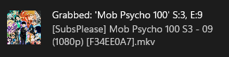
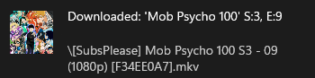
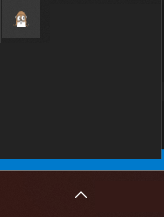

# alertt
alertt is a simple example for using [Eventt](https://github.com/k-x7/eventt), it receive events/triggers from Sonarr then show system alert, it uses [systray](https://github.com/fyne-io/systray) for system tray and [beeeb](https://github.com/gen2brain/beeep) for cross platform system notification.

- ### Grab event


- ### Download event


- ### System Tray


# Build
alertt uses [systray](https://github.com/fyne-io/systray) which need some `flags` or `CGO` based on target platform:

- Windows:
add flag `windowsgui` to "avoid opening a console at application startup".

```shell
git clone https://github.com/k-x7/alertt
cd alertt
go build -o alertt.exe -ldflags "-H=windowsgui" main.go
```

- Linux:
```shell
git clone https://github.com/k-x7/alertt
cd alertt
go build -o alertt main.go
```

- MacOS:
`darwin` target uses `CGO` to interact with the system

```shell
git clone https://github.com/k-x7/alertt
cd alertt
env CGO_ENABLED=1 go build -o alertt main.go
```

# Build without system tray
if system tray not required no platform dependencies exist

```shell
git clone https://github.com/k-x7/alertt
cd alertt
go build -o alertt main_no_tray.go
```

# Usage
After running the building the binary and run it, Go to you Sonarr webpage and add new connection:

- Go to: **Settings** -> **Connect** -> **Click on Plus Sign** -> **Webhook**
- Add a **Name**  for this connection.
- Select type of notification in **Notification Triggers** which you need to receive from Sonarr (Grab and Download needed for notification).
- Add **Tags**  to limit webhook event for specific series if needed.
- Enter **URL**: http://localhost:29172/events or equivalent url based on your http service
- **Method** is not important for us you can leave it on `POST`
- Currently we don't implement **Username/Password** therefore leave it empty.
- Then click Test button, it should have a green check `✅` this mean Sonarr can send events to your service successfully.
- Press `Save` button and you're done.

Example: [Sonarr Webhook Settings Example](https://github.com/k-x7/eventt/blob/master/res/webhook-example.png)